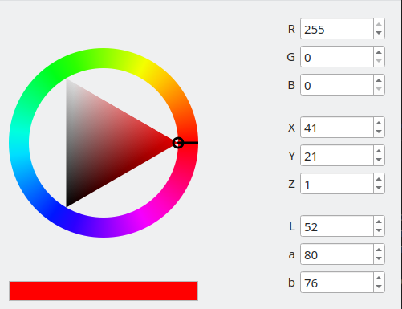

# Color Picker

## Overview

This is a color picker with RGB, XYZ and Lab color formats.



## Building

First, you need download `qmake` using following commands:

```shell
sudo apt install qt5-qmake
sudo apt install qt5base-dev
```

Creating build directory:
```shell
mkdir build
cd build
```

Building application

```shell
qmake ..
make
```

Building application for Windows systems (generates Visual Studio files)
```shell
qmake -tp vc ..
```

Finally, run application with following command:
```shell
./lab1
```

If you have `Qt Creator` application, you can simply open this project (by opening _lab1.pro_ file) and build it.

## Usage

The color picker is represented in `flow::qwidgets::color_picker` class (inherited from `QDialog`).

The code shows the simplest way to use `flow::qwidgets::color_picker` class:

```c++
#include <QApplication>
#include <flow/color_picker.hpp>

int main(int argc, char *argv[]) {
    QApplication a(argc, argv);

    flow::qwidgets::color_picker color_picker;
    color_picker.show();

    return QApplication::exec();
}
```
